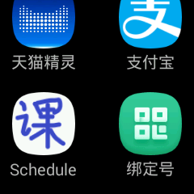
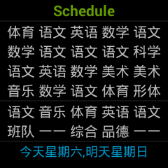

# XTC-ClassSchedule

Simple Class Scheule APP for XTC Q2.  电话手表小天才Q2的课表程序

## Information about Q2

1.XTC  Q2, 240x240, 512M Disk, 256M Mem

```shell
>adb shell pm list libraries
library:android.test.runner
library:com.android.future.usb.accessory
library:com.android.location.provider
library:com.android.media.remotedisplay
library:com.bbk.hwversion
library:com.broadcom.bt
library:javax.obex
```

```gradle
    minSdkVersion 19
    targetSdkVersion 19
```

2.config in AndroidManifest.xml as

```xml
android:theme="@android:style/Theme.NoTitleBar"
```

3.USB 数据线序

```shell
o   o o o  
红、白、绿、黑
```

## Screen



